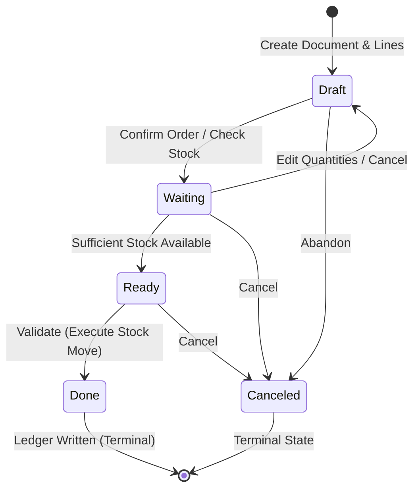
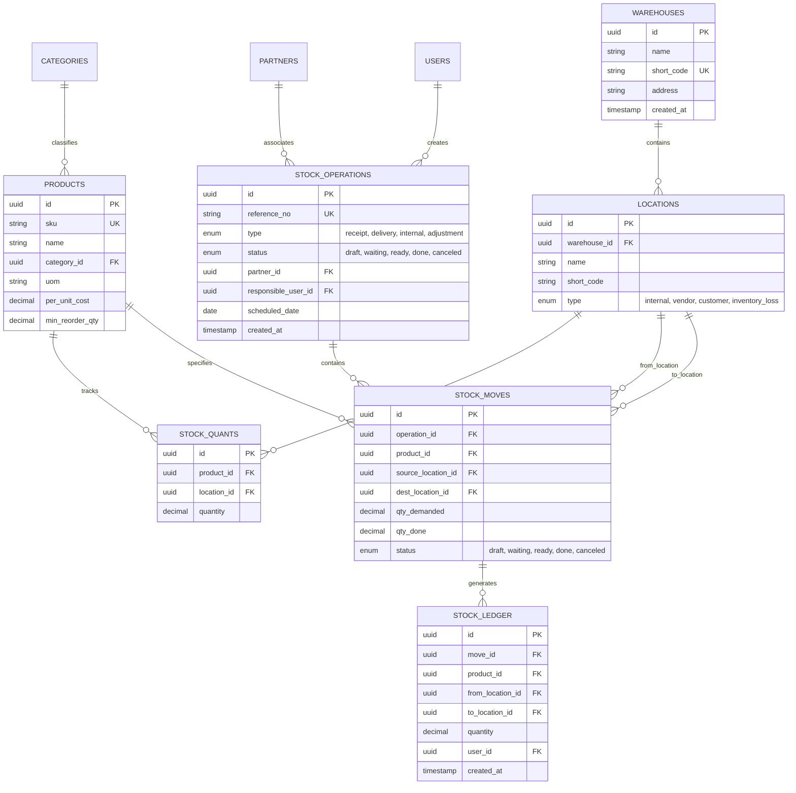
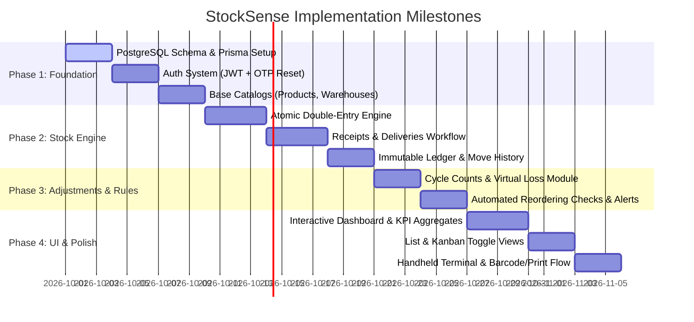

# StockSense — Modern Real-Time Inventory Management System (IMS)

> **Enterprise-grade, double-entry inventory ledger built for multi-warehouse tracking, deterministic document lifecycles, and real-time operational visibility.**

---

## 1. Executive Summary & Problem Context

Traditional inventory management in small to medium enterprises typically relies on manual registers, siloed spreadsheets, or basic CRUD database counters. These approaches inevitably suffer from:

* **Inventory Drift & Ghost Stock:** Discrepancies between physical inventory and recorded numbers due to unrecorded movements, partial picks, or race conditions.
* **Lack of Auditability:** Single-counter architectures (`UPDATE products SET stock = stock - 5`) overwrite current state, discarding the historical context of *who* moved *what*, *from where*, *to where*, *when*, and *why*.
* **Fragmented Operations:** Incoming vendor shipments, customer dispatch, internal warehouse transfers, and physical cycle counts are managed across disparate tools with no unified workflow.
* **Concurrency Hazards:** Multiple warehouse workers picking the same SKU simultaneously without row-level locking causes negative inventory and overselling.

**StockSense** solves these core challenges by implementing an **Odoo-inspired Double-Entry Inventory Engine** backed by an **immutable ledger**, **deterministic state machine**, and **dual-layer stock caching**, tailored for two key personas:
1. **Inventory Managers:** Strategic oversight of vendor receipts, customer fulfillment, reorder thresholds, inventory valuation, and multi-location audit trails.
2. **Warehouse Ground Staff:** High-velocity execution of day-to-day warehouse operations (shelving, picking, internal rack transfers, and physical audit adjustments) via intuitive, mobile-optimized list and kanban interfaces.

---

## 2. Core Architectural Approach

StockSense does not treat inventory as an arbitrary number stored on a product record. Instead, it models inventory strictly as **flows of goods between discrete locations**.

```
┌─────────────────────────┐                                 ┌─────────────────────────┐
│     Source Location     │ ─── (Stock Move / Ledger) ───►  │  Destination Location   │
│ (Vendor / Rack A / Loss)│                                 │ (Rack B / Customer / WH)│
└─────────────────────────┘                                 └─────────────────────────┘
```

### 2.1 The Double-Entry Inventory Engine

In classical accounting, money never appears or disappears; every debit to one account is matched by a credit to another. StockSense applies this exact principle to physical goods:

* **Location Classification:**
  * **Internal Locations (`internal`):** Physical spaces owned by the company (e.g., `WH/Stock`, `WH/Zone-A/Rack-03`, `WH/Production-Floor`). Stock here counts toward total on-hand inventory.
  * **Vendor Locations (`vendor`):** Virtual external sources representing suppliers. Moving stock from a Vendor Location to an Internal Location increases company stock (Receipt).
  * **Customer Locations (`customer`):** Virtual external destinations representing clients. Moving stock from an Internal Location to a Customer Location decreases company stock (Delivery Order).
  * **Inventory Loss / Scrap Locations (`inventory_loss`):** Virtual counterpart locations for physical count adjustments, shrinkage, scrap, or damage.

* **Unified Operation Abstraction:**
  Under this architecture, **all four inventory operations are identical under the hood**:

| Operation Type | Source Location Type | Destination Location Type | Impact on Company Stock |
| :--- | :--- | :--- | :--- |
| **Receipt (Incoming)** | Virtual (`vendor`) | Physical (`internal`) | **Increases (+)** |
| **Delivery Order (Outgoing)** | Physical (`internal`) | Virtual (`customer`) | **Decreases (-)** |
| **Internal Transfer** | Physical (`internal`) | Physical (`internal`) | **Net Zero (Relocated)** |
| **Adjustment (Shrinkage/Damage)** | Physical (`internal`) | Virtual (`inventory_loss`)| **Decreases (-)** |
| **Adjustment (Surplus Found)** | Virtual (`inventory_loss`) | Physical (`internal`) | **Increases (+)** |

### 2.2 Dual-Layer Inventory Model (Quants + Ledger)

To satisfy both **high-frequency read performance** (dashboard queries, real-time stock checks) and **regulatory compliance / zero-data-loss auditability**, StockSense implements a two-tier model:

```
                      ┌──────────────────────────────────────┐
                      │        Stock Move Validation         │
                      └──────────────────┬───────────────────┘
                                         │ (ACID Transaction)
                    ┌────────────────────┴────────────────────┐
                    ▼                                         ▼
      ┌──────────────────────────┐              ┌───────────────────────────┐
      │  stock_quants (Cache)    │              │ stock_ledger (Audit Log)  │
      ├──────────────────────────┤              ├───────────────────────────┤
      │ • Real-time (Product,Loc)│              │ • Append-only, Immutable  │
      │ • Fast O(1) balance check│              │ • Complete move history   │
      │ • Row-level lock target  │              │ • Forensic traceability   │
      └──────────────────────────┘              └───────────────────────────┘
```

1. **The Quant Cache Layer (`stock_quants`):**
   * Stores the current net balance for each unique `(product_id, location_id)` pair.
   * Enables $O(1)$ instantaneous stock availability checks without aggregating millions of historical ledger records.
   * Acts as the primary target for pessimistic locking (`SELECT ... FOR UPDATE`) during order validation.

2. **The Immutable Audit Ledger (`stock_ledger`):**
   * An append-only historical log recording every finalized stock movement with timestamp, user ID, reference number, source location, destination location, and quantity.
   * Never updated or deleted; discrepancies are corrected exclusively via compensating moves.

---

## 3. Rationale: Why This Approach?

Understanding the design decisions behind StockSense highlights why simpler alternatives fall short in enterprise environments:

### 3.1 Why Double-Entry instead of Mutating a Single `stock` Column?
* **Problem with Single Counter:** If a table has `products.quantity = 100`, updating it to `90` loses the identity of the recipient, whether it was 10 items dispatched to Customer X or 10 damaged items moved to scrap. If numbers do not match physical counts, debugging the root cause is impossible.
* **The Double-Entry Solution:** Every balance change is linked to an exact source and destination. Total inventory across the universe (internal + external virtual locations) is always strictly conserved ($\sum \Delta = 0$). Bidirectional traceability is mathematically guaranteed.

### 3.2 Why Dual-Layer (Quants + Ledger) instead of Pure Event Sourcing?
* **Problem with Pure Event Sourcing:** Calculating available stock by aggregating `SUM(quantity)` across an append-only ledger for every product card, cart checkout, or dashboard widget creates an $O(N)$ computational bottleneck that degrades database performance under high transaction volumes.
* **The Dual-Layer Solution:** `stock_quants` acts as an materialized transactional cache within the same ACID boundary as the ledger write. You get the sub-millisecond lookup speed of a single counter combined with the full compliance and audit integrity of an event log.

### 3.3 Why Virtual Locations for Stock Adjustments?
* **Problem with Separate Adjustment Logic:** Many systems create custom adjustment tables with arbitrary `+` or `-` flags, introducing branching logic throughout the codebase.
* **The Virtual Location Solution:** An adjustment for 3 damaged steel rods is simply a regular stock move from `WH/Stock` to `Virtual/Inventory-Loss`. The core engine requires zero custom logic for adjustments, eliminating edge cases.

### 3.4 Why PostgreSQL with Row-Level Locking (`SELECT FOR UPDATE`)?
* **Concurrency Hazards in Warehouses:** Two pickers fulfilling separate delivery orders simultaneously might both see 5 units of SKU-A in stock. Without row-level locks, both pickers validate the operation, driving stock to $-5$ (negative inventory).
* **The PostgreSQL Transaction Solution:** When validating an outgoing move, the database locks the specific `stock_quants` row for that SKU and location (`SELECT quantity FROM stock_quants WHERE ... FOR UPDATE`). Subsequent transactions must wait until the first commits, guaranteeing availability checks are atomic and eliminating race conditions.

---

## 4. Deterministic Document Lifecycle

All operational documents (`Receipt`, `Delivery Order`, `Internal Transfer`, `Adjustment`) follow a deterministic finite state machine (FSM). Stock balances are **only mutated when a document transitions to `Done`**.



### Document Status Definitions
* **`Draft`:** Document created. Line items, quantities, and target locations can be freely edited. No reservation or stock impact.
* **`Waiting`:** Availability check initiated. The system verifies whether source locations possess sufficient stock. If stock is insufficient, the document remains `Waiting` (flagged in yellow/red on the dashboard).
* **`Ready`:** Stock availability confirmed and soft-reserved. Ground staff can pick, pack, or prepare the goods.
* **`Done`:** Operation validated. In an atomic transaction:
  1. Source location quant is decremented.
  2. Destination location quant is incremented.
  3. Immutable record is committed to `stock_ledger`.
  4. Automatic reordering rules check if stock has fallen below `min_reorder_qty`.
* **`Canceled`:** The operation is aborted with no ledger impact.

---

## 5. Reference Numbering Architecture

In accordance with the operational blueprint, each stock operation generates a unique, human-readable reference following a standard hierarchical format:

$$\text{Format:} \quad \mathbf{\langle Warehouse\_Code\rangle / \langle Operation\_Type\rangle / \langle Sequence\_Number\rangle}$$

* **Receipts (Incoming):** `WH/IN/0001`, `WH/IN/0002`
* **Deliveries (Outgoing):** `WH/OUT/0001`, `WH/OUT/0002`
* **Internal Transfers:** `WH/INT/0001`, `WH/INT/0002`
* **Adjustments:** `WH/ADJ/0001`, `WH/ADJ/0002`

*Benefits:* Instantly identifiable on physical packing slips, printable barcodes, mobile picking lists, and audit logs.

---

## 6. Core Database Schema

The relational schema is structured in PostgreSQL to enforce referential integrity and strict typing:



### Schema Constraints & Optimization
* **Composite Unique Constraint:** `stock_quants(product_id, location_id)` ensures exactly one row per SKU per location.
* **Check Constraints:** `stock_quants.quantity >= 0` for all physical internal locations (prevents negative stock at the engine level).
* **Targeted Indexes:** B-Tree indexes on `stock_ledger(product_id, created_at)`, `stock_operations(status, type)`, and `stock_moves(operation_id)`.

---

## 7. UI/UX & Blueprint Alignment

Based on the blueprint specifications, the interface is split between management visibility and warehouse execution:

### 7.1 Dashboard & Operational Cards
* **KPI Metrics:**
  * **Total Products in Stock:** Net sum of items across all internal locations.
  * **Low Stock / Out of Stock:** Count of SKUs where $\text{on\_hand} \le \text{min\_reorder\_qty}$.
  * **Receipts Overview:** Total to receive, operations count, and **Late flag** ($\text{scheduled\_date} < \text{today}$).
  * **Deliveries Overview:** Total to deliver, operations count, **Waiting count** (stock unavailable), and **Late flag**.
  * **Internal Transfers:** Scheduled vs in-progress transfers.

### 7.2 List & Kanban Dual Views
* Every operational section (`Receipts`, `Deliveries`, `Move History`) supports a 1-click toggle:
  * **List View:** Dense, sortable tabular data with column search for Reference, Contact, Source/Dest, Date, and Status badges.
  * **Kanban View:** Visual card columns grouped by status (`Draft`, `Waiting`, `Ready`, `Done`), allowing drag-and-drop or rapid status progression.

### 7.3 Ground Operations Terminal & Safeguards
* **Visual Stock Warnings:** On Delivery Order lines, if a requested item has insufficient inventory in the source location, the row is dynamically highlighted in **bold red** with an actionable stock alert badge.
* **Direct Stock Updating:** Managers can execute quick cycle count adjustments directly from the Stock list view.
* **Printable Receipts & Picking Slips:** When an operation reaches `Done`, a standardized PDF receipt/dispatch slip can be printed immediately.
* **Move History Ledger View:**
  * Color-coded transaction indicators: **Green** for inbound movements, **Red** for outbound movements.
  * Multi-item move expansion: Displays sub-rows per product line while maintaining parent reference grouping.

---

## 8. Technology Stack Selection & Rationale

| Layer | Chosen Technology | Architectural Rationale |
| :--- | :--- | :--- |
| **Frontend Framework** | **React / Next.js (TypeScript)** | Server-side rendering for instant dashboard loads, type safety across shared schema models, and high performance. |
| **Styling & Components**| **Tailwind CSS + shadcn/ui** | Custom design system control, accessible primitives, sleek dark/light modes, and mobile-responsive layouts for handheld scanners. |
| **Backend API** | **Node.js (NestJS / Express) or FastAPI** | Strong async I/O handling, robust modular architecture, and native JSON handling for complex document payloads. |
| **Database & ORM** | **PostgreSQL + Prisma / SQLAlchemy** | Rock-solid ACID transaction support, strict referential integrity, row-level locking primitives, and type-safe database migrations. |
| **Authentication** | **JWT + Secure HTTP-only Cookies + OTP Flow** | Stateless auth for API scalability; OTP email/SMS verification for self-service password resets as required by specs. |
| **State & Data Fetching**| **TanStack React Query** | Automatic caching, optimistic updates, background refetching for real-time dashboard KPIs without manual polling. |

---

## 9. Phased Implementation Roadmap



### **Phase 1: Foundation (Data Modeling, Auth & Catalogs)**
* Configure PostgreSQL database and define Prisma/SQLAlchemy models.
* Implement authentication with role-based access (Inventory Manager vs Warehouse Staff) and OTP password recovery.
* Build CRUD APIs and UI for Products, Categories, Warehouses, and Sub-locations (Zones/Racks).

### **Phase 2: The Core Stock Engine (Operations & Ledger)**
* Build transactional transfer service handling receipts, delivery orders, and internal transfers.
* Implement deterministic document state machine (`Draft` $\rightarrow$ `Waiting` $\rightarrow$ `Ready` $\rightarrow$ `Done`).
* Integrate row-level locks on `stock_quants` and write immutable records to `stock_ledger`.
* Generate formatted sequence numbers (`WH/IN/0001`, `WH/OUT/0001`).

### **Phase 3: Stock Adjustments & Automated Safeguards**
* Implement inventory physical count reconciliation: compute $\Delta = \text{Counted} - \text{Recorded}$ and generate balancing moves to/from virtual loss locations.
* Implement low-stock alert triggers fired whenever an outgoing move drops available quant below `min_reorder_qty`.
* Enforce zero-negative stock database constraints.

### **Phase 4: Dashboard, Dynamic Filtering & Polish**
* Build executive dashboard with KPI aggregation queries (Late receipts, pending deliveries, low stock warnings).
* Implement multi-faceted filter bar (Filter by document type, status pills, warehouse dropdown, SKU search).
* Build Kanban and List views for all operations with status-based drag-and-drop.
* Optimize mobile/handheld viewports for warehouse staff and enable document printing.

---

## 10. Summary

By uniting the **double-entry bookkeeping paradigm** with modern **event auditing** and **responsive UI design**, StockSense delivers an enterprise-grade inventory engine that eliminates inventory drift, prevents race conditions, and provides end-to-end operational clarity from supplier dock to customer doorstep.
